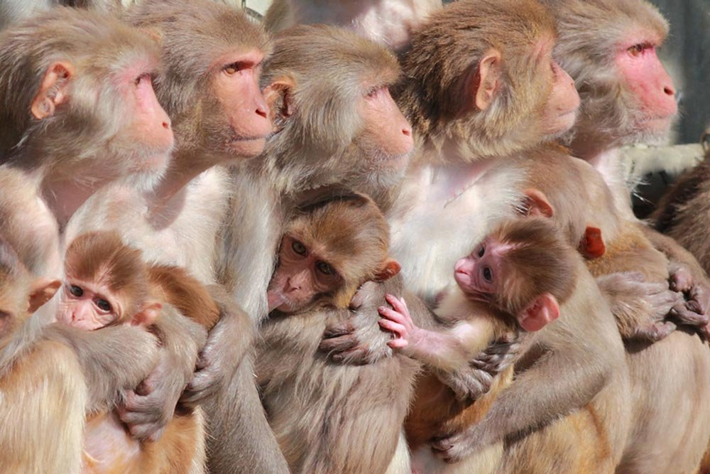
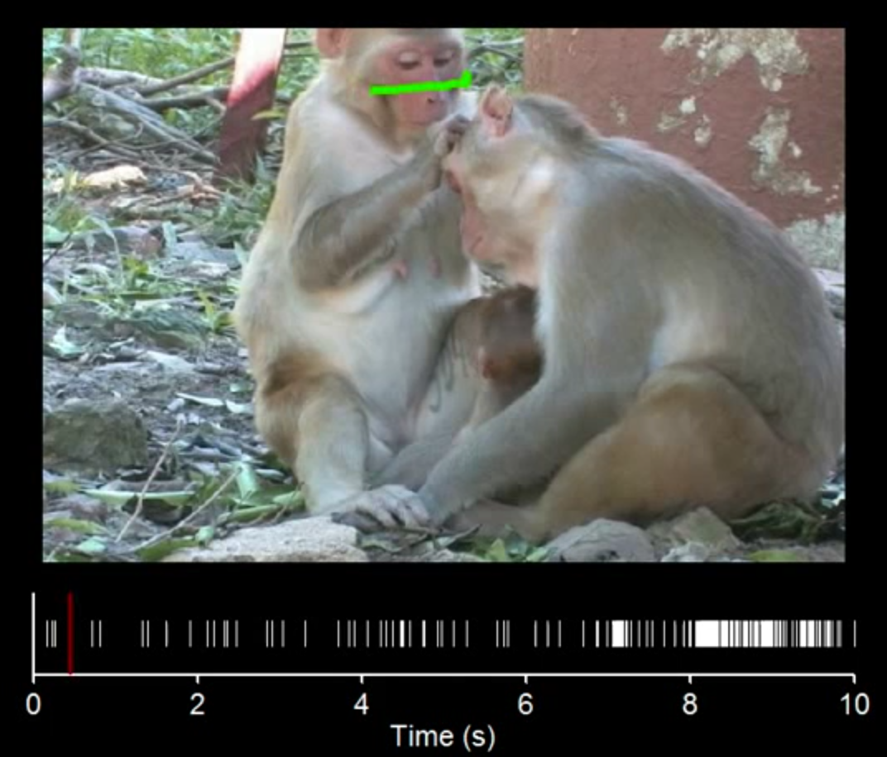

==================================
MF3D Background
==================================

Why are neuroscientists creating virtual reality monkeys? The answer requires a brief history of the field of social neuroscience and the importance of the macaque monkey as an animal model for understanding the human brain and psychiatric disorders. 

.. contents:: :local:

Studying the social primate brain
-------------------------------------

.. figure:: _images/DocFigs/NHPSpeciesPieChart.png
  :align: right
  :figwidth: 30%
  :width: 100%
  :alt: Primate species in research

  While non-human primates (NHPs) make up only a very small fraction of animals used in biomedical research, the majority of NHPs used in research are Rhesus macaques. Data from `NIH (2017) <https://orip.nih.gov/sites/default/files/508%20NHP%20Evaluation%20and%20Analysis%20Final%20Report%20-%20Part%201.pdf>`_.

In order to advance our limited understanding of how complex primate brains
like ours work to coordinate social interactions, we need animal models that
allow us to ethically study the neural correlates at the cellular level. 
Non-human primates represent a crucial resource in this endeavor, and the `Rhesus 
monkey <https://en.wikipedia.org/wiki/Rhesus_macaque>`_ (*Macaca mulatta*) - a species of Old World monkey - is one of the most promising and popular (Figure 1; `NIH, 2017 <https://orip.nih.gov/sites/default/files/508%20NHP%20Evaluation%20and%20Analysis%20Final%20Report%20-%20Part%201.pdf>`_). 

  Group-housed Rhesus macaques (image from `CNPRC <https://cnprc.ucdavis.edu/how-researchers-are-protecting-non-human-primates-from-measles-outbreak/>`_)

In the wild, Rhesus macaques have the second largest territorial range of any primate on earth (after humans). They live in large troops composed of up to hundreds of individuals, which are organized by strict social hierarchies and governed by rules of social interaction. They rely predominantly on their high acuity vision for gathering information about the intentions and internal states of their conspecifics. The similarity of these macaque traits to our own make the macaque the best available animal model for understanding the neural processes underlying complex social behaviors that are unique to primates like us.

Face processing in the macaque brain
-------------------------------------

.. figure:: _images/Figures/Gross1984.png
  :align: right
  :figwidth: 40%
  :width: 100%
  :alt: Gross et al., 1972 & 1984

  Peri-stimulus time histograms (PSTHs) show changes in firing rate of a neuron in inferotemproal cortex that is sensitive to changes in the head angle of the macaque presented to the subject as photographic stimuli (`Desimone et al., 1984 <https://doi.org/10.1523/JNEUROSCI.04-08-02051.1984>`_).

Neural responses to images of faces in the macaque brain were first reported by `Gross et al. (1972) <https://doi.org/10.1152/jn.1972.35.1.96>`_. The approach of recording extracellular spiking activity during visual stimulation of the anesthetized monkey followed that of `Hubel & Wiesel (1968) <https://doi.org/10.1113/jphysiol.1968.sp008455>`_. Subsequent electrophysiology studies revealed that many of these neurons in the macaque superior temporal sulcus (STS) are sensitive to specific types of facial information, including head and eye gaze direction, identity, and facial expression (`Perrett et al., 1982 <https://doi.org/10.1007/BF00239352>`_; `1985 <https://doi.org/10.1098/rspb.1985.0003>`_; `Hasselmo, Rolls & Baylis, 1989 <10.1016/s0166-4328(89)80054-3>`_). 

.. figure:: _images/Figures/Freiwald_patches.jpg
  :align: left
  :figwidth: 25%
  :width: 100%
  :alt: Macaque fMRI

  Regions of 'face selective' voxels in the macaque brain localized using functional magnetic resonance imaging (fMRI) suggest a brain network (`Landi & Freiwald, 2017 <https://doi.org/10.1126/science.aan1139>`_).

The development of non-invasive functional magnetic resonance imaging (fMRI) in the 1990s lead to the discovery of face selective regions of ventral visual cortex in humans (`Kanwisher et al., 1997 <https://doi.org/10.1523/JNEUROSCI.17-11-04302.1997>`_) and subsequently the discovery that face-selective neurons were also clustered together in specific regions of the macaque inferotemporal (IT) cortex (`Tsao et al., 2003 <https://doi.org/10.1038/nn1111>`_; `2006 <https://doi.org/10.1126/science.1119983>`_; `Pinsk et al., 2005 <https://doi.org/10.1073/pnas.0502605102>`_), prefrontal cortex (`Tsao et al., 2008 <https://doi.org/10.1038/nn.2158>`_) and medial temporal lobe (`Landi & Freiwald, 2017 <https://doi.org/10.1126/science.aan1139>`_). 

Limitations of traditional vision neuroscience approach
---------------------------------------------------------

  Natural video stimuli used by `Mosher and colleagues (2015) <https://doi.org/10.1016/j.cub.2014.08.063>`_ revealed that some amygdala neurons are sensitive to whether the subject is looking at the eyes of another animal. Click image to view movie.

The reductionist approach that has proven so successful for understanding the neurophysiological basis of visual processing in early visual areas, typically relies on simplified, abstract or artificial stimuli in order to allow for systematic, parameterized testing along stimulus dimensions of interest. However, the artificial nature of these experimental paradigms raises questions of their relevance to the types of visual experiences that the brain naturally encounters. This tension between rigorous control and ethological validity is perhaps most conspicuous in trying to understand the visual processing of social cues, to which much of the primate brain appears dedicated.

Consequently, scientists have more recently begun exploring alternative approaches that utilize more complex, ethologically valid visual stimulation paradigms (`Hasson et al., 2003 <https://doi.org/10.1126/science.1089506>`_; `Mosher, Zimmerman & Gothard, 2014 <https://doi.org/10.1016/j.cub.2014.08.063>`_; `Russ & Leopold, 2015 <https://doi.org/10.1016/j.neuroimage.2015.01.012>`_; `McMahon et al., 2015 <https://doi.org/10.1523/JNEUROSCI.3825-14.2015>`_; `Park et al., 2017 <https://doi.org/10.1016/j.neuron.2017.07.014>`_; `Sliwa & Freiwarld, 2017 <https://doi.org/10.1126/science.aam6383>`_). However, the trade-off of using 'natural' video stimuli is the loss of experimental control. While the visual and semantic content of video footage containing human actors is at least partially under the control of the director, natural movies of macaque subjects cannot be easily choreographed to address specific research questions.

Development of Macaque Avatars
-------------------------------

.. _avatars-fig:

.. figure:: _images/DocFigs/MacaqueAvatarsFig.png
  :align: left
  :figwidth: 40%
  :width: 100%
  :alt: Macaque avatars

  **Developmental history of digital macaque avatars. A.** `Steckenfinger & Ghazanfar, 2009 <https://doi.org/10.1073/pnas.0910063106>`_ **B.** `Ghazanfar et al., 2013 <https://doi.org/10.1073/pnas.1214956110>`_ **C.** Artist: `Tim Mrozek <https://www.artstation.com/timrozek>`_ (`Paukner et al., 2014 <https://doi.org/10.1111/desc.12207>`_; `Simpson et al., 2016 <https://doi.org/10.1038/srep19669>`_) **D.** Artist: `Damien Montelliard <https://www.3dminfographie.com/en/>`_ (`Wilson et al., 2019 <https://doi.org/10.1101/758458>`_) **E.** (`Siebert et al., 2020 <https://doi.org/10.1523/ENEURO.0524-19.2020>`_) **F.** Artist: `Kelly Bullock, 2019 <https://www.kellybullockart.com/macaquemonkey>`_ (`Martinez-Trujillo lab <http://martinezlab.robarts.ca/>`_, unpublished) **G.** `Barbary macaque (M.sylvanus) <https://en.wikipedia.org/wiki/Barbary_macaque>`_, by artist `Shariq Altaf, 2018 <https://area.autodesk.com/gallery/barbary-macaque/>`_. **H.** `Japanese macaque (M.fuscata) <https://en.wikipedia.org/wiki/Japanese_macaque>`_ by artist `Andre Holzmeister, 2017 <www.andreholzmeister.com/primate_pages>`_. **I.** Japanese macaque by studio `Kleos Animation, 2018 <www.kleosanimation.com>`_.

Digital macaque 'avatars' have been used in behavioral and neuroscience research for over a decade (:ref:`Figure 1 <avatars-fig>`). This approach has typically involved a trade-off between ethological validity (i.e. how natural and/or 'real' the visual stimulus appears to the subject) and experimental control. Indeed, an early study concluded that macaque subjects may experience a perceptual phenomenon known as the 'uncanny valley', whereby semi-realistic artificial representations of faces elicit more negative emotional responses than either real or obviously artificial faces (`Steckenfinger & Ghazanfar, 2009 <https://doi.org/10.1073/pnas.0910063106>`_). 

Since the earliest uses of macaque avatars (:ref:`Figure 1A <avatars-fig>`), technological advances in graphic processing power and decreases in cost have lead to increased accessibility and photorealistic quality of rendering for complex particle systems (such as hair and fur) and naturalistic lighting (such as subsurface scattering). Given a studio budget, state of the art CGI is now almost `indistinguishable from video <https://www.youtube.com/watch?v=HjHiC0mt4Ts>`_, while even low-budget projects utilizing open-source tools such as `Blender <https://www.blender.org>`_ can now achieve high-quality results.

Despite these technological advances, the time and cost of employing skilled digital professionals to generate realistic 3D models of macaques can be prohibitive for lab budgets. The duplication of these efforts across many labs who opt not to share their intellectual property is ultimately a waste of resources for the research community. MF3D is the first ever publicly available macaque avatar resource for the scientific research community.

Virtual Reality: ethologically validity and experimental control
------------------------------------------------------------------

.. figure:: _images/Renders/MF3D_SceneDemo.png
  :align: right
  :figwidth: 50%
  :width: 100%
  :alt: MF3D avatar in a naturalistic VR

  An example frame of the MF3D avatar inserted into a naturalistic virtual environment, rendered with Blender's Cycles engine. 

While the use of macaque avatars rendered in isolation is the logical extension of the traditional visual neuroscience approach, a major benefit of the flexibility provided by a digital avatar is the ability to embed it in more naturalistic virtual environments. This can take the form of either offline rendered film-like realistic scenes, or real-time rendered computer game-like scenes. These approaches offer the ability to address a range of research questions that it would not be possible to test using traditional video stimuli or real-life interactions between animals.

