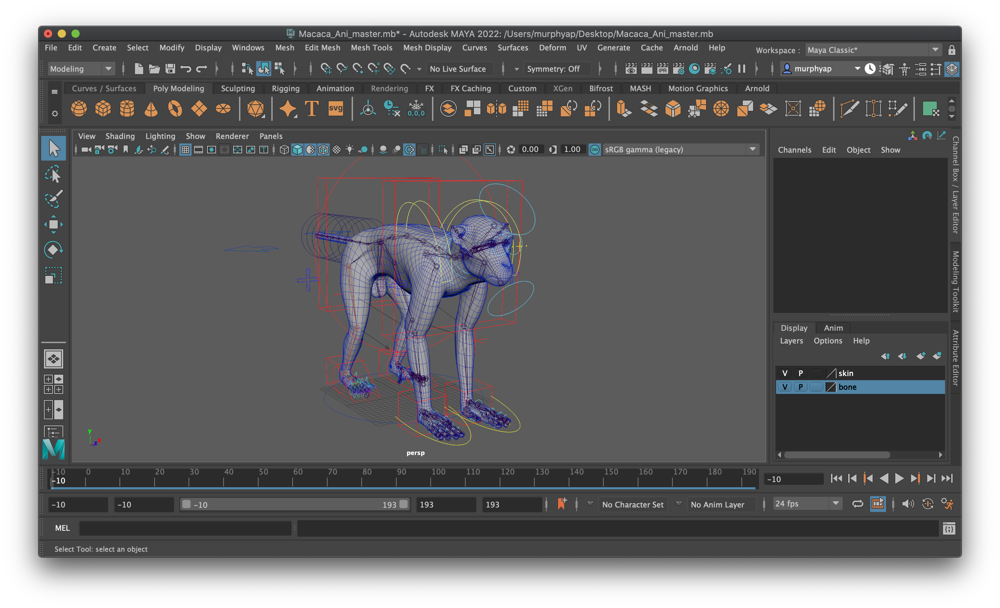
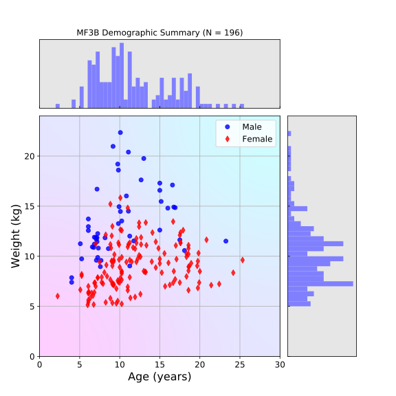

******************
MF3D Development
******************

The MF3D project is under active development to provide new tools and media resources to help advance our understanding of primate behavior and its neural implementation.

.. contents::
  :local:

:fa:`monkey` MB3D - Macaque Body 3D Model
============================================

Rigged macaque body
----------------------

The original MF3D macaque model was limited to the face, head and upper torso, due to the coverage of the CT data used to generate the model. However, in order to present the virtual macaque in naturalistic contexts, it would be advantageous to have the MF3D cranio-facial model attached to a whole body.

While there are many commercially available 3D models marketed as 'macaques', the quality and anatomical accuracy of these models is variable, and few include a rig armature, muscle simulation, or fur. Through collaboration with a professional digital design studio, we acquired a high quality, full body model of a macaque that includes all of these features. We then performed a virtual head transplant in order to seamlessly combine the MF3D head and face model with the new body.

MB3D: Macaque body-space
--------------------------

For MF3D we constructed a macaque 'face-space' model based on analysis of statistical variation in craniofacial morphology from a sample of CT data from real animals. We are now applying this same approach to the rest of the macaque body to form MB3D: a parameterized statistical model of macaque body morphology.

Computed Tomography (CT) data were acquired from 200 Indian-Chinese Rhesus macaques (aged 2.25 to 25 years) from the `California National Primate Research Center <https://cnprc.ucdavis.edu/>`_ were scanned in supine position. A subset of these data are available via Morphosource as part of the `rhesus macaque admixture project <https://www.morphosource.org/Detail/ProjectDetail/Show/project_id/291>`_.

:fa:`fingerprint` MF3D Identity Expansion
=============================================

:fa:`gamepad` MF3D for Game Engines
========================================

