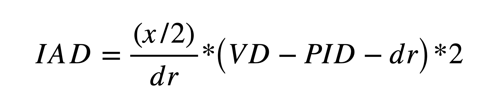

.. _Methods_Stereoscopic:

==========================================
:fa:`flask` Methods - Stereoscopic Depth
==========================================

.. contents:: :local:

:fa:`camera` Virtual Camera Setup
------------------------------------------

To achieve realistic (i.e. geometrically veridical) stereoscopic renders, the experimental visual presentation environment is precisely replicated *in silica*. In Blender the virtual cameras are positioned the same distance from the avatar as the real subject’s viewing distance from the display screen, using off-axis frusta and an inter-axial distance equal to the subjects’ average interocular distance (35 mm). The field of view of the virtual camera is set to match the horizontal angular subtense of the display screen from the subject’s perspective. 

.. panels::
  :container: container-lg pb-3
  :column: col-lg-12 p-1
  :header: bg-primary text-white
  :body: bg-light
  :card: shadow

  **Viewing geometry**

  ^^^

  .. tabbed:: A

    .. image:: _images/ML_Figs/MurphyLeopold_Fig3A.jpg
      :align: right
      :width: 40%
      :alt: Virtual camera placement for stereoscopic depth scaling

    **A.** Schematic illustration (view from above) of the virtual replication of real-world viewing geometry. The observer was always located at a fixed :badge:`viewing distance,badge-primary` (*VD*) from the plane of the screen, with the center of the screen aligned to the observer’s cyclopean eye. A pair of virtual cameras are spaced the equivalent of the subject’s :badge:`inter-pupillary distance,badge-primary` (*IPD*) apart, with off-axis frusta (blue and red triangles). The position of the virtual macaque in 3D space is restricted by the viewing frusta, which are determined by the :badge:`size of the screen,badge-primary` (*Sx*) and the :badge:`viewing distance,badge-primary` (*VD*). 

  .. tabbed:: B

    .. image:: _images/ML_Figs/MurphyLeopold_Fig3B.jpg
      :align: right
      :width: 40%
      :alt: Overcoming parallax error

    **B.** When a 2D image is presented peripherally on a flat display, the projection of that image onto the subjects retina becomes distorted due to parallax error. By moving the virtual 3D model to a peripheral location and then rendering the image it is possible to produce retinal stimulation consistent with real-world geometry. **C.** When the avatar is positioned peripherally but oriented toward the observer, the resulting 2D image is more perceptually similar to the same object at the central location. 

  .. tabbed:: C

    .. image:: _images/ML_Figs/MurphyLeopold_Fig3D.jpg
      :align: left
      :width: 100%
      :alt: Depth rendering

    **D.** Depth map generated from Z-buffer rendering to high-dynamic range format (Open-EXR). **E.** Stereoscopic 3D rendering (requires red-cyan anaglyph glasses for viewing). **F.** Random-dot stereogram (red-cyan anaglyph) generated using the depth map in D, which contains the same binocular disparity content as E, but no other visual cues to depth or object form.

:fa:`vr-cardboard` Stereoscopic Displays
---------------------------------------------

In our own use, we have favored stereoscopic presentation methods that allow for the use of passive polarizing filter 3D glasses, thus keeping active electronics away from the subjects. To preserve color information, this should ideally be a polarizing filter, but could instead utilize interference filters (INFITEC) or standard color anaglyph filters.

- LG 55EF9600 55" OLED TV, 3840 x 2160 @ 60Hz
- VPixx ProPixx projector with Depth Q polarizing filter 
- Optoma UHZ45 projector with Volfoni polarizing filter
- Epson (x 2) with INFITEC interference filters

:fa:`cube` Depth cue manipulations
-------------------------------------

Ordinarily, different visual depth cues congruently signal the same depth information. However, for experimental questions it can be useful to independently control depth cues. One method for manipulating binocular disparity (stereoscopic) depth independently from monocular cues (shading, texture, perspective, etc.) is to keep the object at constant virtual scale but systematically adjust the inter-axial distance of the virtual cameras. The interaxial distance required to produce a given virtual depth (*dv*) is calculated as:

Where *VD* is the viewing distance of the subject from the screen (cm), *PID* is the position-in-depth of the virtual object from the plane of the screen (and the convergence plane of the virtual stereo cameras), and *dr* is the real depth of the virtual object relative to the convergence plane (cm). For changes in disparity-defined position-in-depth, a global horizontal offset is applied to the left and right eye images of the object **before** compositing with any background or scene images.

.. panels::
  :container: container-lg pb-3
  :column: col-lg-12 p-1
  :card: shadow

  .. image:: _images/Figures/Murphy_2022_InterAxial.png
    :align: left
    :width: 70%

