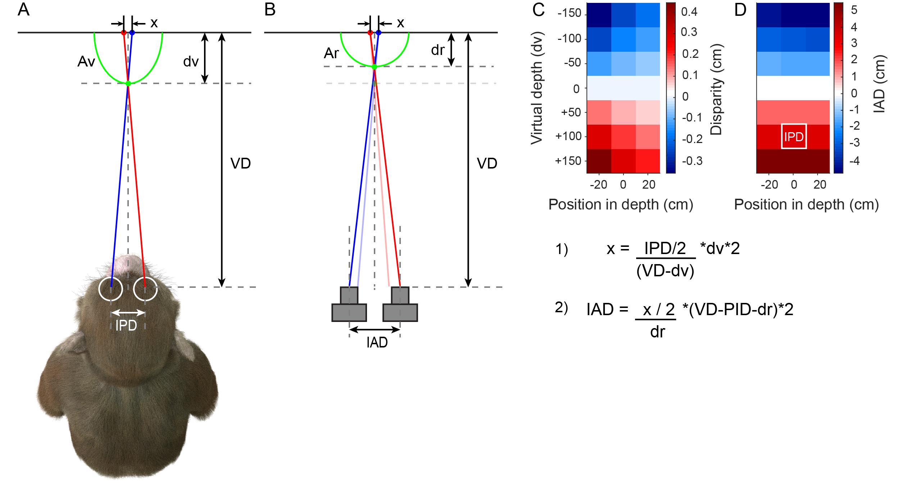

.. _Methods_Stereoscopic:

==========================================
:fa:`flask` Methods - Stereoscopic Depth
==========================================

.. contents:: :local:

Virtual Camera Setup
-------------------------------------

  **A.** 

Stereoscopic Display
-------------------------------------

