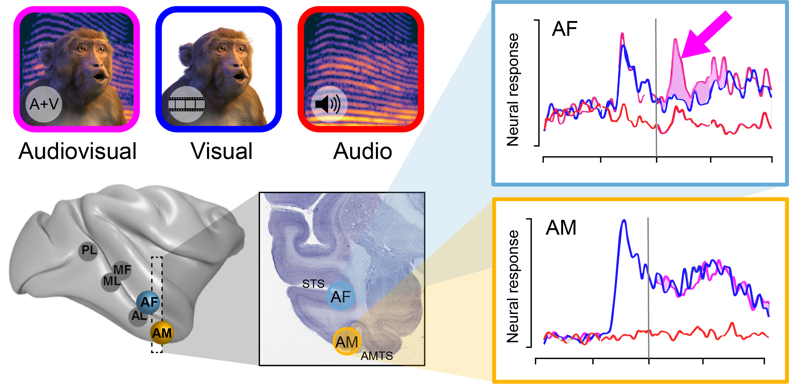

#############
MF3D Research
#############

Visual stimuli generated by the MF3D project are being actively used by neuroscience research labs across the world. Below are a subset of the published articles and conference abstracts reporting data from experiments using this freely available scientific resource.

Publications
============

* **Khandhadia AP, Murphy AP, Romanksi LM, Bizley JK, Leopold DA (2021)**. 	Audiovisual Integration in Macaque Face Patch Neurons. *Curr. Bio.*

* **Taubert J, Japee S, Murphy AP, Tardiff CT, Koele EA, Kumar S, Leopold DA, & Ungerleider LG (2020)**. `Parallel processing of facial expression and head orientation in the macaque brain. <https://doi.org/10.1523/JNEUROSCI.0524-20.2020>`_ *J.Neurosci.*

* **Murphy AP & Leopold DA, (2019)**. `A parameterized digital 3D model of the Rhesus macaque face for investigating the visual processing of social cues. <https://doi.org/10.1016/j.jneumeth.2019.06.001>`_ *J.Neurosci.Methods* 

Research summaries
===================

Natural stereoscopic depth amplifies responses of face-selective neurons in the macaque. 
-----------------------------------------------------------------------------------------------

.. image:: _images/Figures/Murphy2020_Fig1.png
  :width: 400
  :align: right
  :class: align-right
  :alt: Murphy et al., (in prep)

*Murphy AP, Khandhadia AP, Koyano K, Esch EM, Leopold DA (in prep).*

This study used stereoscopic 3D presentations of the macaque avatar faces to generate realistic depth percepts. Chronic exctracellular neural recordings from three of the face-selective regions of inferotemporal (IT) cortex revealed that many face selective neurons were tuned to faces with natural stereoscopic depth profiles, as opposed to 2D or inverted depth faces. This finding was robust across variations of the stimulus position-in-depth, suggesting that face cells are tuned to 3D shape rather than to specific binocular disparities.

Audiovisual Integration in Macaque Face Patch Neurons.
----------------------------------------------------------------------------------

*Khandhadia AP, Murphy AP, Romanksi LM, Bizley JK, Leopold DA (2021).*

In this study, the authors recorded single unit activity from the anterior fundus (AF) face-patch of the STS and the anterior medial (AM) face patch in ventral inferotemporal cortex while subjects viewed animated sequences of the macaque avatar performing various vocalizations, with and without audio. Responses of neurons in AF were modulated by the addition of the auditory signal, whereas few AM neurons showed audio-visual modulated responses.

Parallel processing of facial expression and head orientation in the macaque brain.
-----------------------------------------------------------------------------------------------

.. image:: _images/Figures/Taubert2020_Fig6.png
  :width: 400
  :align: right
  :class: align-right
  :alt: Taubert et al., 2020

`Taubert J, Japee S, Murphy AP, Tardiff CT, Koele EA, Kumar S, Leopold DA, & Ungerleider LG (2020). <https://doi.org/10.1523/JNEUROSCI.0524-20.2020>`_ 

In this study, the authors investigated the processing of changeable facial information using a functional MRI-adaptation paradigm in awake male macaques. They found a double dissociation of face-selective regions in the superior temporal sulcus (STS) processing facial expression and those processing head orientation. The face-patches in the STS fundus were most sensitive to facial expression, as was the amygdala, whereas those on the lower, lateral edge of the sulcus were most sensitive to head orientation. 

A parameterized digital 3D model of the Rhesus macaque face for investigating the visual processing of social cues. 
---------------------------------------------------------------------------------------------------------------------

.. image:: _images/Figures/MurphyLeopold_Fig7.jpg
  :width: 400
  :align: right
  :class: align-right
  :alt: Murphy & Leopold, 2019

`Murphy AP & Leopold DA, (2019). <https://doi.org/10.1016/j.jneumeth.2019.06.001>`_

This methods paper describes the creation of the MF3D avatar model and stimulus sets, but also reports preliminary data from chronic extracellular recordings from neurons in three of the face-selective regions of the macaque STS. Unlike typical object vision experiments, a large number of dimensions of facial appearance were co-varied. Many of the neurons recorded exhibited sensitivity to head orientation, which was typically robust across variations in the other parameters. Surprisingly, some cells that initially appeared not to be driven by any stimuli were strongly modulated by highly specific combinations of variables.

Acknowledgements
=================

This work was funded by the `National Institute of Mental Health (NIMH) <https://www.nimh.nih.gov/index.shtml>`_ intramural program and utilized the `Neurophysiology Imaging Facility (NIF) <https://www.nimh.nih.gov/research/research-conducted-at-nimh/research-areas/research-support-services/nif/index.shtml>`_ and NIH's `HPC Biowulf cluster <https://hpc.nih.gov/>`_ resources. Stimuli are hosted on `Figshare <https://figshare.com/projects/MF3D_Release_1_A_visual_stimulus_set_of_parametrically_controlled_CGI_macaque_faces_for_research/64544>`_ under the `Creative Commons CC-BY-NC 4.0 <https://creativecommons.org/licenses/by-nc/4.0/>`_ license, while software tools are hosted on `GitHub <https://github.com/MonkeyGone2Heaven/MF3D-Tools>`_ under the `GNU General Public License GNU GPLv3 <https://choosealicense.com/licenses/gpl-3.0/#>`_. All visual stimulus renders were generated using the open-source software `Blender <www.blender.org>`_.